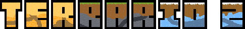
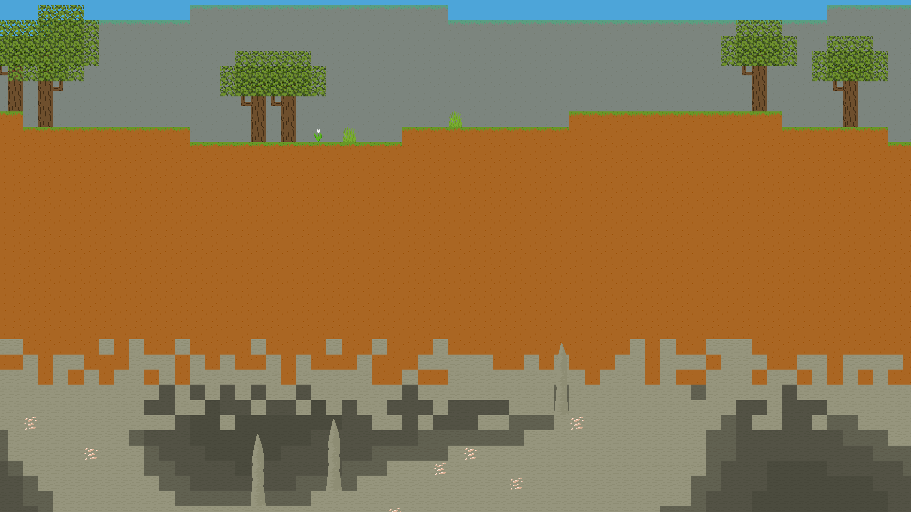
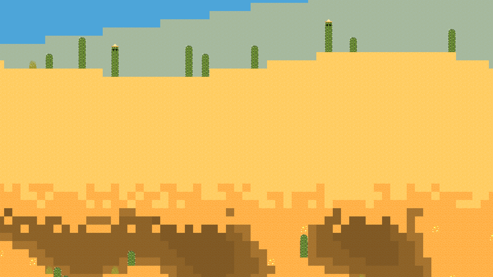
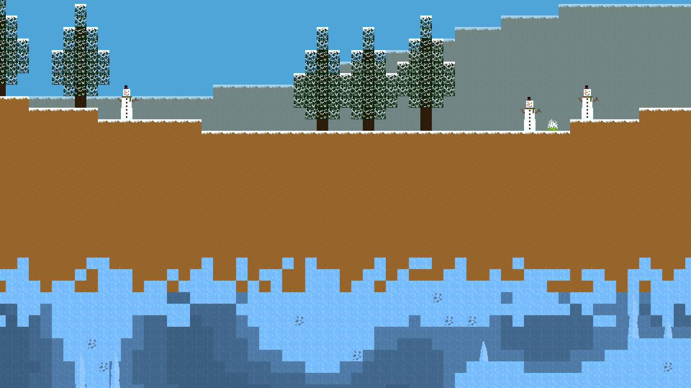

<div align="center">
  
</div>


<div align="center">
    
[](https://pypi.org/project/terrario/)
[](https://github.com/MaitreRenard18/Terrario-2/blob/master/LICENSE)

</div>

# Présentation du projet :
Terrario 2 est la suite du mondialement connu [Terrario](https://github.com/MaitreRenard18/Terrario).

Le but du jeu est <b>d'améliorer sa foreuse au niveau maximum</b>, pour miner dans de <b>nouveaux environnements</b>. <br>
Pour ouvrir <b>l'interface d'améliorations</b>, il faudra appuyer sur la <b>touche "A"</b> de votre clavier. <br>
Pour améliorer votre foreuse, il faudra un <b>nombre de minerais requis</b>, affiché dans l'interface d'améliorations. <br>
Les minerais que vous avez minés sont affichés dans <b>l'inventaire</b> du joueur, qui s'affiche en appuyant sur la <b>touche "E"</b> du clavier.

# Comment jouer ?
Il vous suffit d'exécuter les commandes suivantes :
```bash
  $ pip install terrario # Pour installer le jeu.
  $ terrario # Pour le lancer.
```

Ou alors, vous pouvez également installer Terrario manuellement, en installant le module python Pygame version 2.1.1 minimum et Opensimplex en exécutant la commande suivante :
```bash
  $ pip install -r Requirements.txt
```
Et en ouvrant "Terrario.pyw".

# Fonctionnalités :
- Un monde infini généré de manière procédurale.
- Différents environnements.
- Un système de sauvegarde.
- Un inventaire.
- Des améliorations pour le joueur.

# Captures d’écran :



