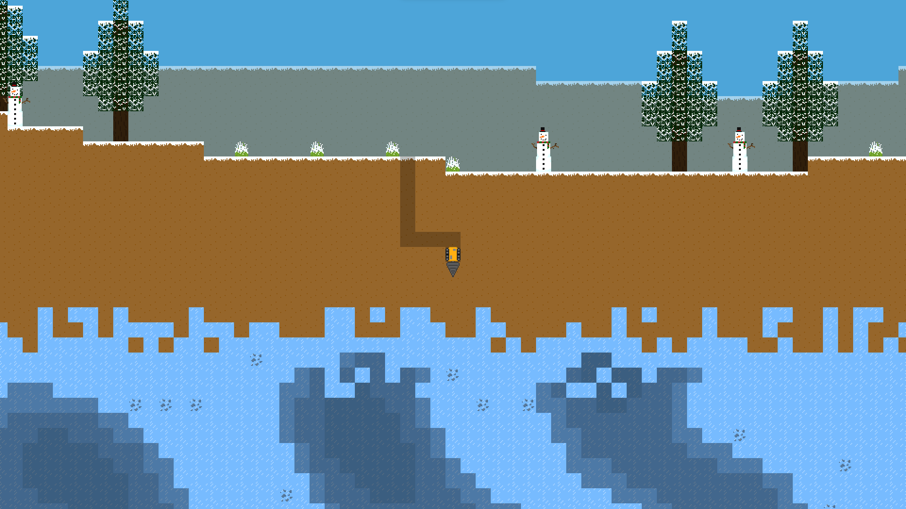

<div align="center">
  
  
  


# Présentation du projet :
Terrario 2 est la suite du mondialement connu [Terrario](https://github.com/MaitreRenard18/Terrario).

# Comment jouer ?
Il vous suffit d'exécuter les commandes suivantes :
```bash
  $ pip install terrario # Pour installer le jeu.
  $ terrario # Pour le lancer.
```

Ou alors, vous pouvez également installer Terrario manuellement, en installant le module python Pygame version 2.1.1 minimum et Opensimplex en exécutant la commande suivante :
```bash
  $ pip install -r Requirements.txt
```
et en ouvrant "Terrario.pyw".

# Fonctionnalités :
- Un monde infini généré de manière procedurale.
- Différents environments.
- Un système de sauvegarde.
- Un inventaire.
- Des améliorations pour le joueur.

# Captures d’écran :



