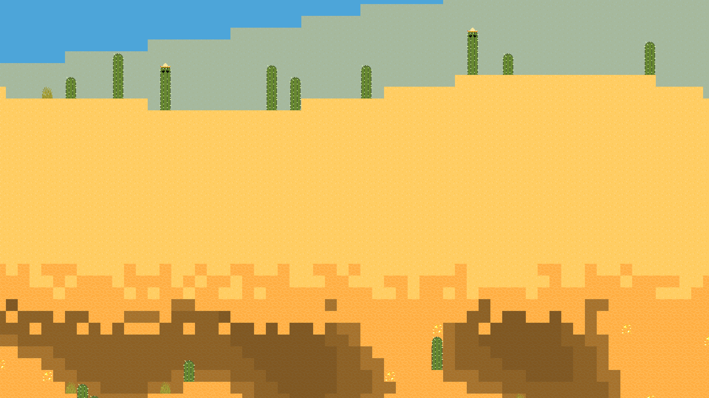
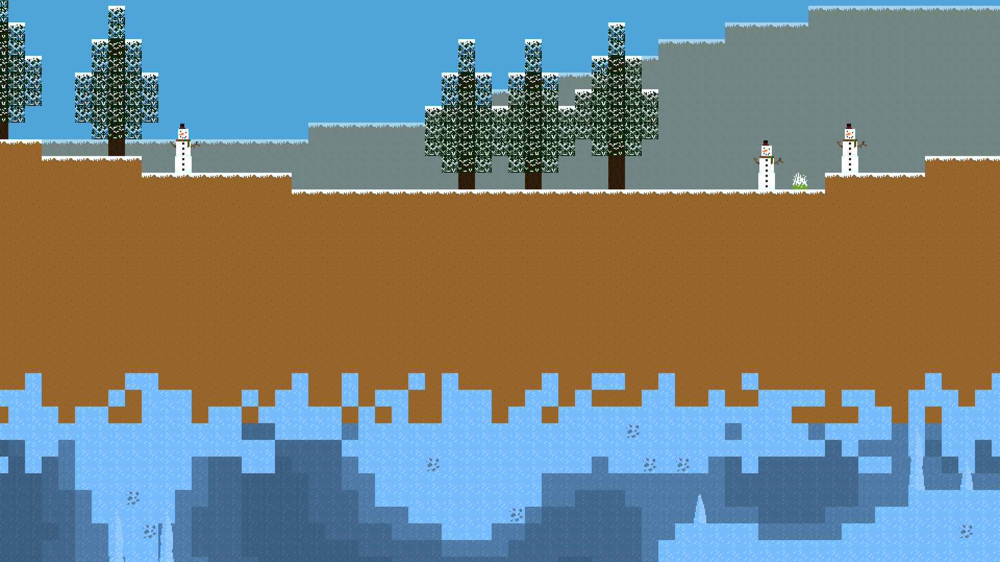

<div align="center">
  
</div>


<div align="center">
    
[](https://pypi.org/project/terrario/)
[](https://github.com/MaitreRenard18/Terrario-2/blob/master/LICENSE)

</div>

# Présentation du projet :
Terrario 2 est la suite du mondialement connu [Terrario](https://github.com/MaitreRenard18/Terrario).

Le but du jeu est <b> d'améliorer sa foreuse au niveau maximum</b>, pour miner dans de nouveaux environnements.
Pour ouvrir l'interface d'améliorations, il faudra appuyer sur la touche "A" de votre clavier.
Pour améliorer votre foreuse, il faudra un nombre de minerais requis, affiché dans l'interface d'améliorations.
Les minerais que vous avez minés sont affichés dans l'inventaire eu joueur, qui s'affiche en appuyant sur la touche "E" du clavier.

# Comment jouer ?
Il vous suffit d'exécuter les commandes suivantes :
```bash
  $ pip install terrario # Pour installer le jeu.
  $ terrario # Pour le lancer.
```

Ou alors, vous pouvez également installer Terrario manuellement, en installant le module python Pygame version 2.1.1 minimum et Opensimplex en exécutant la commande suivante :
```bash
  $ pip install -r Requirements.txt
```
Et en ouvrant "Terrario.pyw".

# Fonctionnalités :
- Un monde infini généré de manière procédurale.
- Différents environnements.
- Un système de sauvegarde.
- Un inventaire.
- Des améliorations pour le joueur.

# Captures d’écran :



