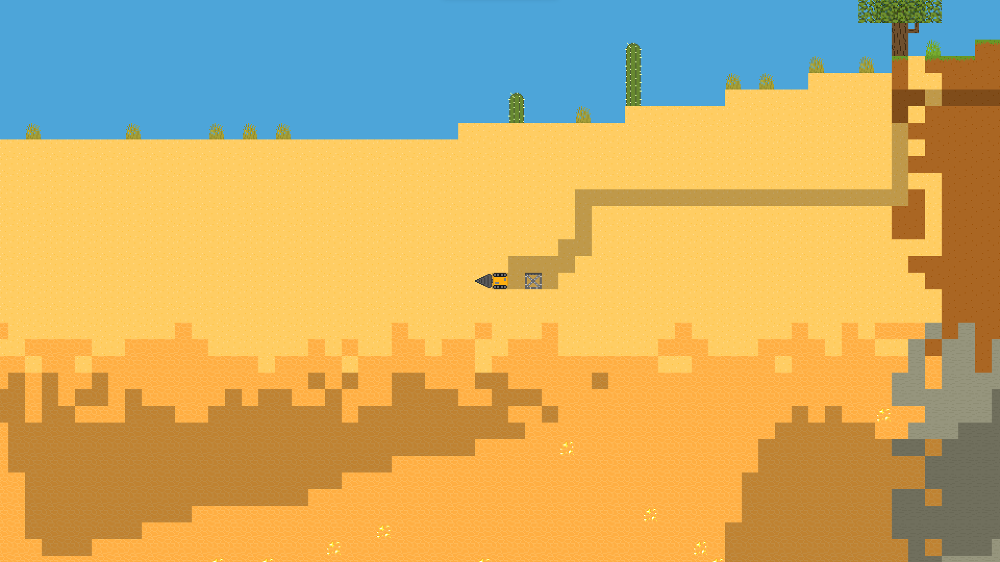

<p align="center">
  
</p>

[](https://github.com/MaitreRenard18/Terrario-2/blob/master/LICENSE)

# Présentation du projet :
Terrario 2 est la suite du mondialement connu [Terrario](https://github.com/MaitreRenard18/Terrario).

# Prérequis :
Il faudra installer le module python Pygame version 2.1.1 minimum et Opensimplex pour que le jeu fonctionne.

Ci-dessous la commande pour installer le module `terrario` et ses dépendances :

```bash
  $ pip install .
```

# Comment jouer ?
Pour lancer le jeu, exécuter tout simplement Terrario.pyw.

# Captures d’écran :



